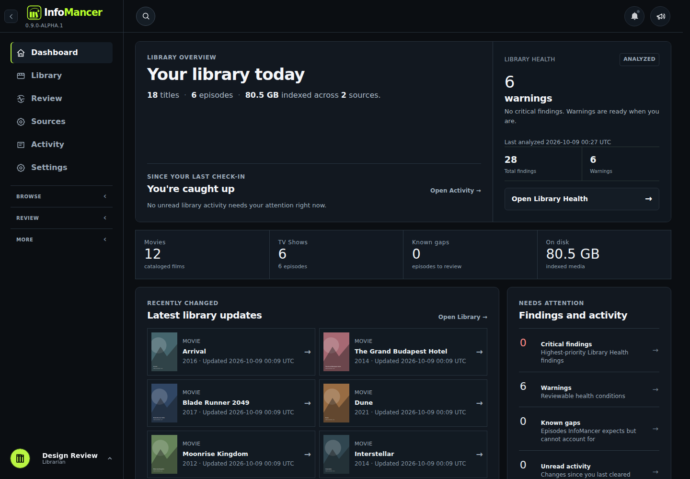
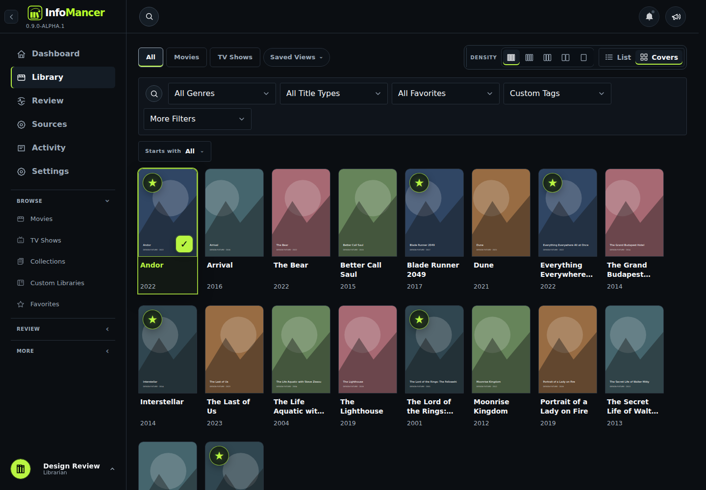
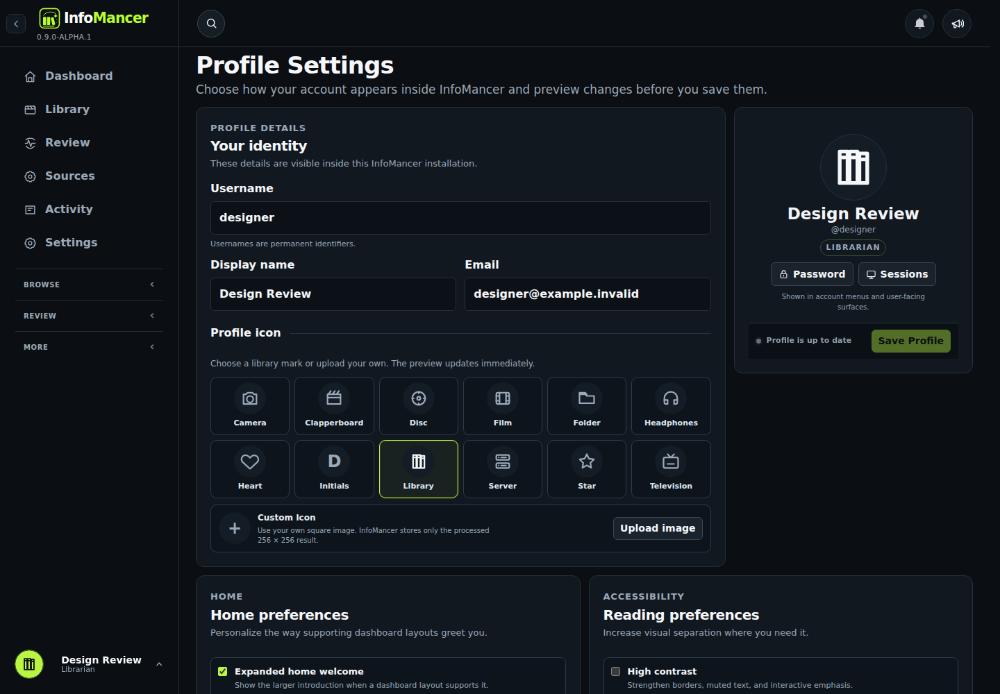
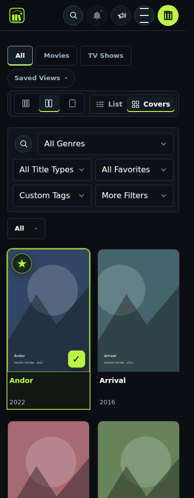

# Coherent dark design review

Branch: `design/coherent-dark-polish-09`.

The aim is a quieter media catalog: dark surfaces, restrained lime, predictable typography, and spacing that stays consistent across pages and density settings.

## Findings and changes

| Finding | Refinement |
| --- | --- |
| Different page heading sizes made Profile, Details, and operations feel unrelated. | Shared 28–34px page headings, 20px section headings, and consistent sans-serif typography. |
| Glows, gradients, pills, and broad lime fills competed with the media artwork. | Flat charcoal panels, neutral selected tabs with a thin lime indicator, quieter status labels, and restrained primary actions. |
| Space distributed between small posters made density changes create uneven-looking gaps. | Stable poster footprints, regular 16px column gaps, two-line title slots, and aligned metadata. |
| Hover moved posters and their selection frames. | Stationary artwork with border/tone feedback and the existing touch/keyboard actions. |
| Short settings cards were stretched to match unrelated tall forms. | Independent content-sized form panels; related overview/comparison cards retain their alignment. |
| Narrow controls, recovery labels, and session details widened the page. | Controls wrap; long content stays inside the panel; the narrow Library toolbar uses a second row. |
| Logo geometry clipped the end of the wordmark and competed with the version badge. | Corrected SVG viewBox, a complete wordmark, and a small version label beneath it on desktop. |
| Verbose or decorative wording added weight without helping a decision. | Direct Review, Health, and dashboard wording with preserved analysis timestamps and filesystem guarantees. |

Changes use the existing CSS owners and controllers. There is no framework change or second theme layer. The branch carries the existing production UI/search foundation and retains persisted views, density, filters, profile choices, permissions, confirmations, and server protection.

The durable rules and ownership map are in [DESIGN.md](../DESIGN.md) and [UX.md](../UX.md).

## Preview

These screenshots use a disposable catalog and illustrative poster fixtures. Those fixtures are not shipped in the application.

### Dashboard

### Library

### Profile

### Phone Library

## Verification

- Python: `python -m unittest discover -s tests`, **1,837 tests run, no failures, four existing skips**.
- Focused Playwright: **eight tests passed**, covering real CSS layout/heading consistency, density gaps, caption alignment, stationary hover, overlay sizing, keyboard focus, reduced motion, forced colors, and existing search behavior.
- Rendered application: **22 routes** at 1440px, 768px, 390px, and 320px, with no document horizontal overflow in the final checks. The core ten routes also have before/after captures. The broader set includes Health, Storage, Libraries, Favorites, account pages, settings, users, Help, and About.
- Live Inspector: opening it retains cover dimensions; its existing close action works.
- Reflow: representative pages checked at 720 CSS px, equivalent to the layout width of a 1440px browser at 200% zoom. This is a layout-equivalence check, not a claim of testing the browser's native zoom UI.
- `DESIGN.md` lint: **zero errors and warnings**. Strict static audit of changed styles: **zero findings**. `git diff --check`: clean.
- The full-project static auditor still reports **320 legacy findings**, mostly native-validation conventions and buttons whose listeners are outside the auditor's view, plus unrelated control issues. This pass does not claim a globally clean static audit or change those workflow contracts.

Browser checks used Chromium 141 via an available headless-shell executable. The repository's Playwright dependency remains unchanged. Physical iPhone/Safari and native browser zoom remain manual acceptance checks. The Docker preview configuration was parsed and inspected; Docker was unavailable in this environment, so the application was run directly with Uvicorn for verification.

## Run it

Follow [RUN_DESIGN_PREVIEW.md](RUN_DESIGN_PREVIEW.md) for an isolated Docker preview on **http://localhost:8792**, or a source-development setup. The separate preview keeps its own account/catalog and mounts media read-only.

## Review and rollout

This is a review branch. Try the preview and check your own catalog, preferred density, and iPhone/Safari before merging. Existing workflow-specific and historical fallback styles remain with their owners; they can be removed only after a scoped regression review. The current production installation is unaffected by the isolated preview and can remain running while it is evaluated.
